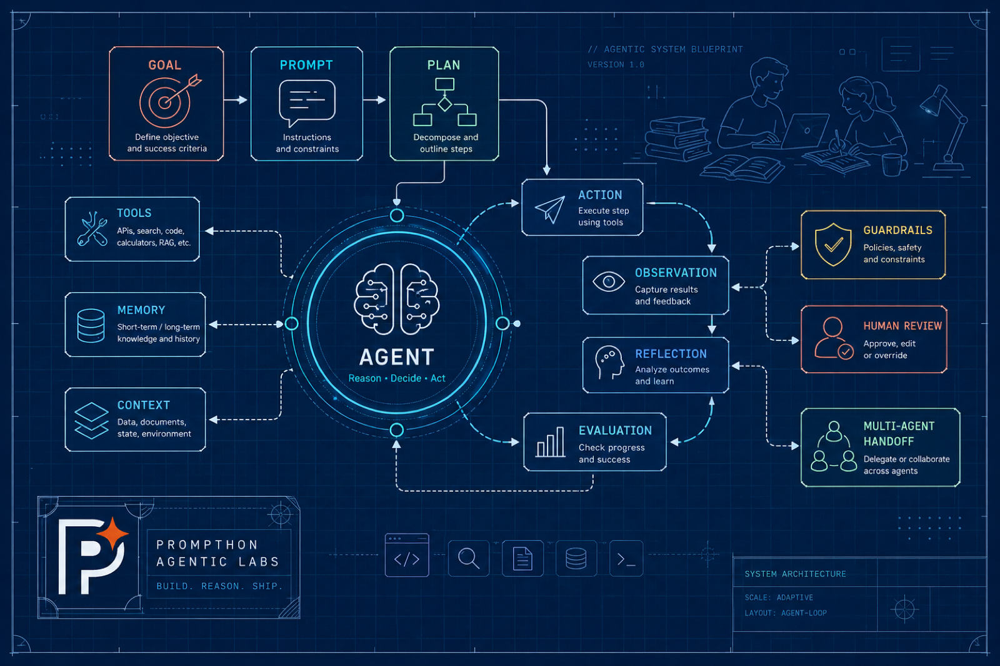

  

  <h1>Prompthon Agentic Labs</h1>

  

    
  

  
  
A public field guide for AI-native learners, early builders, and practitioners exploring how modern agent systems are understood, used, built, evaluated, and operated in practice.

  

    
  

  
  

    <a href="https://labs.prompthon.io/"><strong>labs.prompthon.io</strong></a>
  

  

    <a href="https://github.com/Prompthon-IO"><strong>Organization</strong></a>
    ·
    <a href="https://github.com/Prompthon-IO/agentic-lab"><strong>Repository</strong></a>
    ·
    <a href="https://github.com/Prompthon-IO/agentic-lab"><strong>Star</strong></a>
    ·
    <a href="https://github.com/Prompthon-IO/agentic-lab/subscription"><strong>Watch updates</strong></a>
    ·
    <a href="./CONTRIBUTING.md"><strong>Contribute source</strong></a>
    ·
    <a href="https://github.com/Prompthon-IO/agentic-lab/issues"><strong>Issues</strong></a>
    ·
    <a href="https://discord.gg/sDE2HhGTg4"><strong>Discord</strong></a>
  

  

    
    
    
    
  

---

## Overview

Prompthon Agentic Labs is an AI-native field guide for students, practitioners, and builders exploring modern agent systems from different angles.

Built on **learn, question, and innovate**, the lab is shaped by learners and grounded in real industry practice. It helps readers understand the space, apply AI effectively, or build real systems through parallel paths rather than a single track.

## Why This Lab Fits AI-Native Learners, Practitioners, And Builders

### Built on learn, question, and innovate

This repository encourages active learning, critical thinking, and experimentation rather than passive consumption.

### Built by learners, not only for learners

Many contributors are learners themselves. That keeps the material close to the questions, habits, and learning paths that students, new grads, and next-generation AI-native builders actually have.

### Guided by real industry practice

Through Prompthon programs and industry-facing guidance, the lab remains connected to how frontier teams think, build, iterate, and evaluate in real settings.

### AI-native by design

The content is created through an AI-native workflow that combines AI-assisted drafting, synthesis, iteration, and refinement with expert guidance and review.

### Designed for different paths, not a single track

The lab is organized for different kinds of learners and different intentions. Some people want broad understanding and trend awareness. Some want to apply AI tools to daily work and study. Some want to build real systems and applications. This repository supports all three without forcing one sequence.

## Start Here

Choose the path that best matches what you want from AI right now. These are parallel tracks for different types of learners and builders, not a required sequence.

<table>
  <tr>
    <td valign="top" width="50%">
      <h3>Explorer</h3>
      
For students, newcomers, and curious AI-native readers who want a broad view of AI, agents, trends, and foundational ideas without needing to become engineers.

      
<strong>What you get:</strong> a curated set of high-signal reads that help you learn core concepts, follow important shifts, test ideas with your own thinking, and build a grounded first-hand understanding of the space.

      
<a href="./reading-paths/explorer.mdx"><strong>Open the Explorer guide</strong></a>

    </td>
    <td valign="top" width="50%">
      <h3>Practitioner</h3>
      
For people who want to use AI tools, agents, and workflows to enhance daily life, study, and real work without needing to become full-time engineers.

      
<strong>What you get:</strong> a practical path for learning how to apply AI effectively, choose the right tools and workflows, and operate with leverage in real scenarios, including one-person-company style use cases where AI expands what one person can do without requiring full builder depth.

      
<a href="./reading-paths/practitioner.mdx"><strong>Open the Practitioner guide</strong></a>

    </td>
  </tr>
  <tr>
    <td valign="top" width="50%">
      <h3>Builder</h3>
      
For engineering-minded learners, new grads, and developers who want to build with AI more directly, from agent applications and workflows to startup-style products and technically deeper implementations.

      
<strong>What you get:</strong> a build-oriented path through concepts, patterns, systems, architecture choices, technical details, and concrete examples for people who want to create their own applications and go deeper into implementation.

      
<a href="./reading-paths/builder.mdx"><strong>Open the Builder guide</strong></a>

    </td>
    <td valign="top" width="50%">
      <h3>Contributor</h3>
      
For people who want to shape the lab by adding, revising, curating, or maintaining pages, notes, examples, and outward-facing extensions.

      
<strong>What you get:</strong> a public path into the editorial workflow, templates, review rules, placement standards, and portfolio-relevant open-source contribution.

      
<a href="./reading-paths/contributor.mdx"><strong>Open the Contributor guide</strong></a>

    </td>
  </tr>
</table>

## Contributor Guide

If you want to contribute to Prompthon Agentic Labs, start from the contributor docs rather than ad hoc internal working material.

Public contributions in this repository currently fit into these paths:

- lab articles in `foundations/`, `patterns/`, `systems/`, `ecosystem/`, or
  `case-studies/`
- radar notes in [`radar/`](./radar/)
- source projects in lane-local `examples/` folders
- practitioner skill packages in [`skills/`](./skills/index.mdx)
- curated reference notes in
  [`contributor-kit/reference-notes/`](./contributor-kit/reference-notes/README.md)
- publication extensions in [`publications/`](./publications/README.md) once a
  lab page is ready for an outward-facing article or distribution surface

Start with [Contributing](./CONTRIBUTING.md) and the [Contributor Kit](./contributor-kit/index.mdx). Those pages define the public workflow, templates, review standards, and placement rules for lab articles, notes, and code that belong in this repository.
