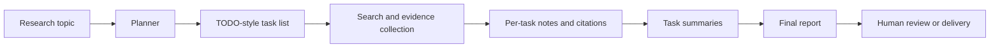

import SupportCTA from "/snippets/support-cta.mdx";

<SupportCTA />

## Summary

Deep research agents turn an open topic into a managed investigation. Instead
of answering from one prompt or one search result, they plan the work, gather
evidence in rounds, summarize partial findings, and compile a traceable report.

## Why It Matters

Research is one of the clearest product surfaces where agent systems can be
useful and dangerous at the same time.

Useful, because the work naturally decomposes into search, reading, note-taking
and synthesis.

Dangerous, because users expect freshness, source quality, and honest handling
of uncertainty. A polished answer without a trustworthy evidence trail is not a
real research product.

## Mental Model

The most durable pattern is a four-part loop:

- `plan`: break the topic into bounded research tasks
- `collect`: gather evidence for each task
- `synthesize`: summarize each task before context overload sets in
- `report`: assemble the final answer with explicit sources and open questions

This is better thought of as a managed workflow than a single clever prompt.
The planner keeps the investigation scoped. The collector expands the evidence
set. The summarizer prevents raw search results from flooding the final report.
The report writer integrates the results into a reader-facing artifact.

## Architecture Diagram

## Tool Landscape

Deep research systems usually combine a small but opinionated toolset:

- search or browsing tools for evidence gathering
- notes or artifact storage for structured intermediate state
- summarization logic that keeps task outputs bounded
- report generation that preserves citations and uncertainty

Human checkpoints matter more here than in many other agent products.

- planning review prevents wasted search cycles
- source review catches weak or irrelevant evidence
- final review catches unsupported synthesis and tone drift

Artifact strategy also matters. Good systems keep explicit task lists, task
summaries, and final reports as inspectable outputs. Those artifacts help with
verification, resume flows, and later reuse.

## Tradeoffs

- Broad search improves coverage, but it also increases noise and source
  quality variance.
- Aggressive task decomposition improves control, but too many tasks create
  overhead and repetition.
- Strong summarization keeps context clean, but it can hide nuance if citations
  are not preserved.
- A single final answer feels smooth, but a staged artifact trail is more
  trustworthy.

Practical defaults:

- plan before searching
- keep citations attached at the task level, not only in the final report
- treat "unknown" as a valid output
- separate evidence gathering from final narrative generation

## Citations

- Source input: [Chapter 14 Automated Deep Research Agent](https://github.com/datawhalechina/Hello-Agents/blob/main/docs/chapter14/Chapter14-Automated-Deep-Research-Agent.md)
- Source input: [Hello-Agents upstream repository](https://github.com/datawhalechina/Hello-Agents)

## Reading Extensions

- [Context Engineering](/systems/context-engineering)
- [Evaluation And Observability](/systems/evaluation-and-observability)
- [Case Studies Overview](/case-studies)

## Update Log

- 2026-04-21: Initial repo-native draft based on imported reference material and lab rewrite rules.
