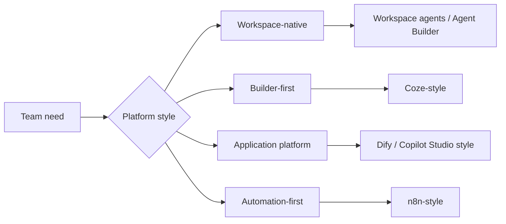

# Agent Platforms And Low-Code Builders

## Summary

Low-code agent platforms turn recurring application patterns into visual,
configuration-first, or workspace-native building blocks. In 2026, the
comparison surface includes not only standalone builder products but also agent
builders that live inside existing productivity suites.

## Why It Matters

Not every useful agent needs to begin with a custom framework. Many teams first
need to validate a product surface, connect common services, or let
non-engineer stakeholders participate in building the workflow.

That is where builder-first, platform-first, automation-first, and
workspace-native surfaces become attractive.

## Mental Model

The current platform market points to six useful anchors:

- `Coze`: builder-first experience for quick assembly, plugins, and publishing
- `Dify`: application platform for orchestration, plugins, knowledge, and
  deployment control
- `n8n`: automation-first workflow platform where agent logic lives inside a
  broader process chain
- `Workspace agents`: shared cloud agents inside ChatGPT and Slack for
  long-running team workflows
- `Agent Builder`: in-context Microsoft 365 agent creation for quick
  declarative scenarios
- `Copilot Studio`: broader Microsoft platform for larger audiences, custom
  integrations, and more advanced control

These are different choices, not direct substitutes.

- builder-first products optimize fast creation and operator friendliness
- workspace-native builders optimize shared agents inside an existing suite
- application platforms optimize broader product and deployment control
- automation platforms optimize integration into existing business processes

## Architecture Diagram

## Tool Landscape

### Global and enterprise coverage

- Workspace agents show a new workspace-native builder surface where teams can
  create shared cloud agents inside ChatGPT, run long-running work in the
  background, and keep the agent inside existing organizational controls.
- Agent Builder shows the same direction on the Microsoft side: quick
  declarative agents built in context with Microsoft 365 knowledge sources,
  shareable inside the suite, but intentionally narrower than Copilot Studio.
- Copilot Studio matters when the audience is larger, the workflow is more
  complex, or the agent needs custom integrations and stronger deployment
  management than Agent Builder is designed to provide.
- Dify still represents the broader open-source application-platform pattern
  where orchestration, deployment control, and extensibility matter together.
- n8n still represents the automation-first pattern where the agent is one step
  inside an operational pipeline rather than the whole product surface.

### China-linked coverage

- Coze and Dify remain strong China-linked reference points for builder-first
  and platform-first agent products with plugin-rich expansion paths.

### Selection criteria

- Choose workspace-native builders when the team already lives inside the host
  suite and wants shared agents with built-in governance and familiar
  permissions.
- Choose builder-first platforms when quick iteration and cross-functional
  participation matter most.
- Choose application platforms when you need a stronger bridge between
  prototype, orchestration, and a deployable product surface.
- Choose automation-first platforms when the agent must live inside an existing
  operational pipeline such as email, CRM, or internal ops tooling.
- Choose a broader enterprise platform such as Copilot Studio when the in-suite
  builder becomes too limited for audience scope, workflow depth, or
  integrations.

## Tradeoffs

- Faster assembly usually means weaker fine-grained control than code.
- Workspace-native builders are attractive because they reduce setup and align
  with existing permissions, but they are bounded by the host suite's extension
  model, rollout pace, and pricing.
- Visual platforms improve accessibility, but complex flows can still become
  hard to debug.
- Rich plugin ecosystems accelerate capability growth, but they also create
  dependency and trust questions.
- Built-in storage, memory, or retrieval layers may be convenient for
  prototypes but insufficient for production durability.

Useful defaults:

- use suite-native builders to validate shared internal workflows quickly
- move to a broader platform or custom code when the host surface becomes the
  blocker
- separate prototype convenience from production requirements early
- keep governance, deployment scope, and integration depth explicit from the
  start

## Citations

- Source input: [Chapter 5 Building Agents with Low-Code Platforms](../references/hello-agents-main/docs/chapter5/Chapter5-Building-Agents-with-Low-Code-Platforms.md)
- Source input: [Extra03 Dify walkthrough](../references/hello-agents-main/Extra-Chapter/Extra03-Dify%E6%99%BA%E8%83%BD%E4%BD%93%E5%88%9B%E5%BB%BA%E4%BF%9D%E5%A7%86%E7%BA%A7%E6%93%8D%E4%BD%9C%E6%B5%81%E7%A8%8B.md)
- Source input: [n8n install guide](../references/hello-agents-main/Additional-Chapter/N8N_INSTALL_GUIDE.md)
- Current official platform readings are listed in `external_readings`.

## Reading Extensions

- [Agent Frameworks](./agent-frameworks.md)
- [Agents Vs Workflows](../foundations/agents-vs-workflows.md)
- [Ecosystem Overview](./README.md)

## Update Log

- 2026-04-23: Refreshed the page with current workspace-agent and Microsoft
  builder-platform signals.
- 2026-04-21: Initial repo-native draft based on imported reference material
  and lab rewrite rules.
