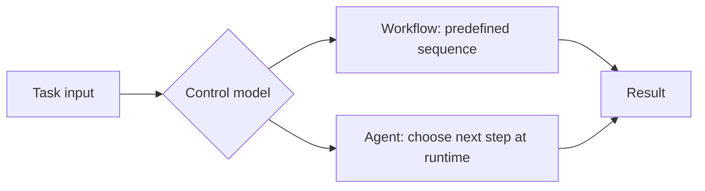

## Summary

Workflows execute a predefined sequence. Agents pursue a goal under changing
conditions. Most real systems sit somewhere between those extremes.

## Why It Matters

Many product and engineering mistakes come from choosing the wrong control
model.

- If the task is stable, using an agent can add cost and unpredictability.
- If the task is ambiguous and changing, using only a rigid workflow can make
  the system brittle and high-maintenance.

Choosing the wrong pattern is often more damaging than choosing the wrong
model.

## Mental Model

The cleanest distinction is about who owns the next step.

- In a `workflow`, the designer owns the next step. The system follows a
  scripted path with explicit branching.
- In an `agent`, the runtime owns the next step. The system chooses actions
  based on the current state, tools, and goal.

This does not mean workflows are simple and agents are advanced. It means they
solve different coordination problems.

Workflows are strongest when:

- the path is known
- the rules are stable
- auditability matters more than flexibility

Agents are strongest when:

- the path is not fully known in advance
- the system needs to search, explore, or adapt
- the environment can change while the task is running

## Architecture Diagram

## Tool Landscape

Most useful products are hybrids rather than pure examples of either side.

- A workflow may call an agent for one ambiguous step.
- An agent may operate inside a larger workflow with strict entry, approval,
  and exit points.
- A research or coding system may use workflow-like stages but agentic
  decision-making inside each stage.

That hybrid design is often the practical answer because it preserves
deterministic structure where structure helps, while reserving autonomy for the
parts that genuinely benefit from it.

## Tradeoffs

- Workflows are easier to test and audit, but they are expensive to maintain
  when edge cases keep growing.
- Agents adapt better, but they need stronger safeguards, observability, and
  fallback design.
- Hybrid systems are often best in practice, but they require clearer
  interface boundaries than either extreme.

Useful defaults:

- choose workflows for deterministic business policy
- choose agents for bounded exploration and judgment
- wrap agents with workflow controls when compliance, approvals, or irreversible
  actions matter

## Citations

- Source input: [Chapter 1 Introduction to Agents](https://github.com/Prompthon-IO/agentic-lab/blob/main/references/hello-agents-main/docs/chapter1/Chapter1-Introduction-to-Agents.md)
- Source input: [Hello-Agents reference boundary](https://github.com/Prompthon-IO/agentic-lab/blob/main/references/README.md)

## Reading Extensions

- [What Are Agent Systems](./what-are-agent-systems)
- [Context Engineering](../systems/context-engineering)
- [Foundations Overview](./README)

## Update Log

- 2026-04-21: Initial repo-native draft based on imported reference material and lab rewrite rules.
