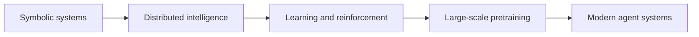

import SupportCTA from "/snippets/support-cta.mdx";

<SupportCTA />

## Summary

The history of agent ideas is best understood as a sequence of attempts to fix
the weaknesses of the previous paradigm: symbolic reasoning, distributed
coordination, learned behavior, and large-scale pretraining each solved one
problem while exposing the next.

## Why It Matters

Modern agent systems are easier to reason about when you know which older
question they are inheriting.

- symbolic systems asked how to represent knowledge explicitly
- multi-agent thinking asked how intelligence could emerge from cooperation
- learning systems asked how capabilities could be acquired instead of
  hand-coded
- large language model systems asked how broad prior knowledge could be loaded
  before task-specific interaction

The current stack is not a clean replacement for those eras. It borrows from
all of them.

## Mental Model

A useful short history has four steps.

- `symbolic era`: expert systems and logic-driven programs showed that explicit
  rules could work in narrow domains, but they struggled with common sense,
  brittleness, and knowledge acquisition.
- `distributed intelligence era`: ideas such as the society of mind reframed
  intelligence as coordination among many specialized processes rather than one
  perfect center.
- `learning era`: connectionist and reinforcement-learning systems showed that
  useful behavior could be learned from data and interaction instead of being
  fully designed in advance.
- `pretraining era`: large language models loaded broad language and world
  priors into one model, making reasoning, planning, and tool use far more
  accessible at runtime.

The through-line is problem pressure. Each stage emerged because the earlier
stage could not scale to the next level of ambiguity, breadth, or autonomy.

## Architecture Diagram

## Tool Landscape

Historical ideas still map onto present-day design choices.

- symbolic thinking survives in tools, schemas, protocols, and deterministic
  workflow rules
- distributed thinking survives in multi-agent systems and modular runtimes
- learning survives in model weights, evaluators, and policy optimization
- pretraining survives in the broad latent prior that modern LLM-based agents
  start with before they see task-specific context

This is why modern agents often feel hybrid rather than pure. The most useful
systems mix explicit structure with learned behavior.

## Tradeoffs

- Symbolic systems are interpretable, but hard to scale across messy reality.
- Distributed systems support specialization, but increase coordination cost.
- Learned systems adapt, but make reasoning harder to inspect.
- Pretrained systems are flexible, but can appear coherent without being
  correct.

A grounded historical view helps avoid false binaries. The practical goal is
not to pick one era. It is to combine the right ideas for the actual task.

## Citations

- Source input: [Chapter 2 History of Agents](https://github.com/datawhalechina/Hello-Agents/blob/main/docs/chapter2/Chapter2-History-of-Agents.md)
- Source input: [Hello-Agents upstream repository](https://github.com/datawhalechina/Hello-Agents)

## Reading Extensions

- [The Agent Systems](/foundations/the-agent-system)
- [LLM Foundations For Agent Systems](/foundations/llm-foundations-for-agent-systems)
- [Foundations Overview](/foundations)

## Update Log

- 2026-04-21: Initial repo-native draft based on imported reference material and lab rewrite rules.
