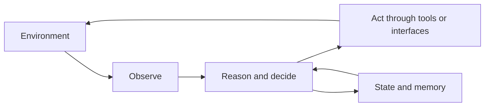

import SupportCTA from "/snippets/support-cta.mdx";

<SupportCTA />

## Summary

An agent system is a goal-directed software system that can observe a changing
environment, decide what to do next, and act through tools or interfaces while
carrying state across steps.

## Why It Matters

The term "agent" is easy to overuse. Many systems now attach the label to
anything with a chat box or an LLM. That makes the category less useful unless
we describe what actually changes when software becomes agentic.

The important shift is not that the system can generate text. It is that the
system can manage an action loop:

- perceive the current state
- choose or revise a plan
- act on the world
- observe results
- continue until it reaches a stopping condition

## Mental Model

A durable definition has four parts:

- `environment`: the part of the world the system operates in
- `perception`: how it learns about that environment
- `action`: how it changes or queries the environment
- `autonomy`: how much decision-making it performs between perception and
  action

Modern agent systems differ from earlier automation because large language
models make it easier to reason over ambiguous instructions, select tools,
rephrase plans, and adapt when the environment changes.

That does not make every LLM application an agent system. The category becomes
most meaningful when the software has:

- an explicit task or goal
- a loop rather than a single response
- access to tools, APIs, files, or other external surfaces
- memory or state that matters across steps

## Architecture Diagram

## Tool Landscape

In practice, agent systems can take several shapes:

- assistants embedded inside developer or work tools
- autonomous workers that pursue a delegated goal
- specialist agents inside multi-agent systems
- research, coding, or operations systems that iterate over evidence and tools

Across those shapes, the core design question is not "does it talk like an
agent?" It is "does it manage a real perception-decision-action loop?"

## Tradeoffs

- More autonomy can reduce manual effort, but it also increases the need for
  monitoring and failure handling.
- Richer environments make agents more useful, but they also make them more
  unpredictable.
- Stronger tool access expands capability, but it raises security and policy
  concerns.
- More state improves continuity, but it makes bad assumptions stick around
  longer.

Good system design therefore starts by being explicit about boundaries:

- what the agent can perceive
- what it can do
- what it is responsible for deciding on its own
- when a human must intervene

## Citations

- Source input: [Chapter 1.1 Introduction to Agents Systems](/foundations/agent-systems/why-agent-systems-matter)
- Source input: [Hello-Agents upstream repository](https://github.com/datawhalechina/Hello-Agents)

## Reading Extensions

- [Agents Vs Workflows](/foundations/agents-vs-workflows)
- [Agent Memory And Retrieval](/patterns/agent-memory-and-retrieval)
- [Foundations Overview](/foundations)

## Update Log

- 2026-04-21: Initial repo-native draft based on imported reference material and lab rewrite rules.
