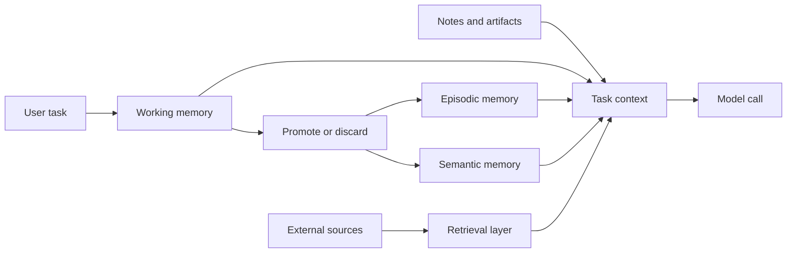

import SupportCTA from "/snippets/support-cta.mdx";

<SupportCTA />

## Summary

Agent memory and retrieval are the persistence layer around a model call. They
decide what survives beyond the current turn, what can be pulled back later,
and what should stay outside the prompt until it is needed.

## Why It Matters

Without memory, agents reset to zero every time they act. Without retrieval,
they are limited to whatever happened to fit inside the current prompt window.
That makes long-running work brittle, personalization shallow, and factual
grounding weak.

A good design separates three jobs:

- Keep the current task coherent.
- Preserve durable signals worth reusing later.
- Fetch external knowledge only when it improves the answer or action.

## Mental Model

Treat memory and retrieval as different but related systems.

- `working memory` holds the active state of the current task or session.
- `episodic memory` stores bounded events, outcomes, and experiences.
- `semantic memory` stores distilled facts, rules, and relationships that stay
  useful across tasks.
- `retrieval` reaches into external knowledge sources that do not belong inside
  the agent itself.

The practical distinction is not just short-term versus long-term. It is also
about ownership.

- Session memory belongs to the running task.
- Durable memory belongs to the agent's operating history.
- Retrieval indexes belong to external documents, databases, or data products.
- Notes and artifacts belong to explicit work products such as TODO lists,
  summaries, reports, or decision logs.

That last category matters because many systems fail by forcing everything into
"memory". A research note, a task checklist, or a generated report is usually
better treated as an artifact than as an invisible memory entry.

## Architecture Diagram

The design goal is not to stuff more information into the model. It is to
stage the right information at the right time.

## Tool Landscape

Common patterns show up across most agent systems:

- Working memory often uses lightweight in-process state with capacity and time
  limits.
- Episodic memory usually combines structured metadata with similarity search
  so events remain searchable by both meaning and recency.
- Semantic memory often benefits from richer normalization because durable
  facts become more valuable when duplicates are merged and relationships are
  explicit.
- Retrieval systems usually start with chunking, indexing, and relevance
  scoring, then add reranking, expansion, or query rewriting only when the base
  pipeline is not enough.
- Notes and artifacts are best stored in human-readable forms when humans may
  need to inspect, edit, or approve them later.

In practice, hybrid retrieval is common because no single method handles every
case well. Keyword matching helps with exact entities and literals. Dense
retrieval helps with semantic similarity. Structured filters help with time
range, user scope, or document type. The right system usually combines them.

## Tradeoffs

- Session memory is fast and cheap, but it disappears on restart and should not
  be trusted as the durable record.
- Durable memory improves continuity, but it introduces write quality problems:
  bad memories are expensive because they keep returning.
- Retrieval gives freshness and breadth, but it also creates latency, ranking
  errors, and citation risk.
- Notes and artifacts improve traceability, but they require governance so the
  agent does not create an unbounded pile of stale documents.

Three design choices matter repeatedly:

- `promotion`: not every working-memory item should become durable.
- `forgetting`: low-value or stale memory must decay, expire, or be archived.
- `boundary`: not every knowledge problem is a RAG problem.

RAG is not enough when the agent needs durable state, action history, or
explicit task checkpoints. Retrieval can answer "what do the documents say?",
but it does not replace task memory, decision logs, or artifact management.

## Citations

- Source input: [Chapter 8 Memory and Retrieval](https://github.com/datawhalechina/Hello-Agents/blob/main/docs/chapter8/Chapter8-Memory-and-Retrieval.md)
- Source input: [Hello-Agents upstream repository](https://github.com/datawhalechina/Hello-Agents)

## Reading Extensions

- [Context Engineering](/systems/context-engineering)
- [Deep Research Agents](/case-studies/deep-research-agents)
- [Patterns Overview](/patterns)

## Update Log

- 2026-04-21: Initial repo-native draft based on imported reference material and lab rewrite rules.
