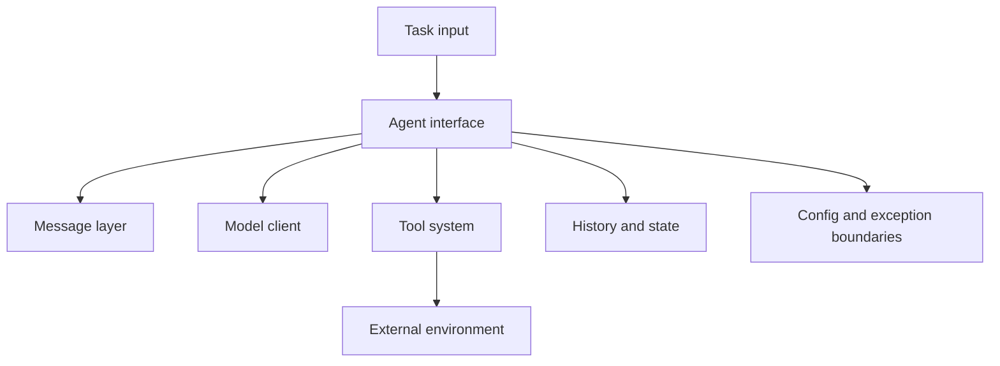

import SupportCTA from "/snippets/support-cta.mdx";

<SupportCTA />

## Summary

Agent runtimes are assembled from a small number of recurring components:
message handling, model access, state management, tool registration, execution
loops, and failure boundaries. These building blocks matter more than any one
framework API.

## Why It Matters

Most agent systems eventually converge on similar runtime questions:

- how messages are represented
- where state lives
- how tools are registered and called
- how loops stop or retry
- how errors surface

Understanding these pieces makes frameworks easier to compare and custom
systems easier to design.

## Mental Model

A minimal runtime usually needs:

- `message layer`: the format used to move user, system, assistant, and tool
  content through the loop
- `model client`: the component that calls the underlying LLM provider
- `agent interface`: the execution entry point that owns task flow and history
- `tool system`: registration, description, validation, and execution surfaces
- `config and exceptions`: the policies that let the runtime behave predictably

The important design choice is not the class hierarchy. It is whether those
responsibilities stay cleanly separated.

## Architecture Diagram

## Tool Landscape

Healthy runtime designs usually share a few traits:

- messages are standardized early so history and traces remain compatible
- the model client is replaceable without rewriting the agent loop
- tools are self-describing enough for the runtime or model to discover them
- state handling is explicit rather than hidden in global side effects
- failures carry structured information instead of generic text blobs

The most reusable runtimes also avoid burying business policy inside the core
execution layer. The runtime should move work, not own the product logic.

## Tradeoffs

- Heavy abstraction can make runtimes flexible, but it can also make them hard
  to learn and debug.
- Very lightweight runtimes are easy to read, but they can collapse under
  growing complexity if tool, state, and error handling are not separated.
- A unified tool interface helps portability, but only if it does not erase the
  real constraints of each tool boundary.

Useful defaults:

- keep the runtime thin
- keep business decisions outside the core loop when possible
- standardize messages and errors early
- make tool registration explicit enough to inspect and test

## Citations

- Source input: [Chapter 7 Building Your Agent Framework](https://github.com/datawhalechina/Hello-Agents/blob/main/docs/chapter7/Chapter7-Building-Your-Agent-Framework.md)
- Source input: [Hello-Agents upstream repository](https://github.com/datawhalechina/Hello-Agents)

## Reading Extensions

- [Reasoning And Control Patterns](/patterns/reasoning-and-control-patterns)
- [Agent Frameworks](/ecosystem/agent-frameworks)
- [Patterns Overview](/patterns)

## Update Log

- 2026-04-21: Initial repo-native draft based on imported reference material and lab rewrite rules.
