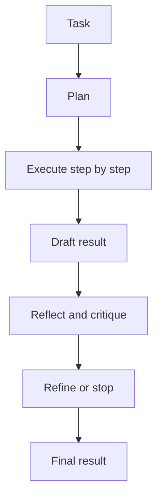

import SupportCTA from "/snippets/support-cta.mdx";

<SupportCTA />

## Summary

Planning and reflection patterns add structure around an agent loop. Planning
breaks a task into an explicit execution path. Reflection evaluates a draft or
trajectory and decides what to improve.

## Why It Matters

Pure step-by-step control is often not enough for longer or more structured
tasks. The agent may need to see the whole shape of the work before acting, or
it may need a deliberate review step after producing an initial answer.

Planning and reflection are two ways to improve quality without pretending the
first pass will always be good enough.

## Mental Model

Planning patterns, such as the plan-then-execute style highlighted in the
imported source material, separate work into two phases:

- generate a task plan
- execute against that plan

Reflection patterns add another loop:

- produce an initial answer or artifact
- critique it
- refine it

These patterns are useful for different reasons.

- planning reduces drift on multi-step structured tasks
- reflection improves quality when first drafts are cheap but correctness or
  performance matters

## Architecture Diagram

## Tool Landscape

Planning works well when the task can be decomposed clearly:

- structured research
- multi-step analysis
- code generation with explicit stages

Reflection works well when the system can meaningfully judge and improve its
own output:

- code quality and performance
- report structure and completeness
- task trajectories that need error correction

Both patterns benefit from lightweight memory because plans, critiques, and
prior drafts need to be available without overwhelming the main context.

## Tradeoffs

- Planning improves coherence, but it can lock the system into a weak plan if
  replanning is impossible.
- Reflection improves quality, but it increases latency and model cost.
- Detailed plans help structured work, but they can become overhead for simple
  tasks.
- Strong critique prompts can improve outputs, but they also create another
  place where prompt design can fail.

Useful defaults:

- add planning when the task has more than one meaningful dependency chain
- add reflection when quality matters enough to justify another pass
- stop iterating when additional review no longer changes the decision

## Citations

- Source input: [Chapter 4 Building Classic Agent Paradigms](https://github.com/datawhalechina/Hello-Agents/blob/main/docs/chapter4/Chapter4-Building-Classic-Agent-Paradigms.md)
- Source input: [Hello-Agents upstream repository](https://github.com/datawhalechina/Hello-Agents)

## Reading Extensions

- [Reasoning And Control Patterns](/patterns/reasoning-and-control-patterns)
- [Evaluation And Observability](/systems/evaluation-and-observability)
- [Patterns Overview](/patterns)

## Update Log

- 2026-04-21: Initial repo-native draft based on imported reference material and lab rewrite rules.
