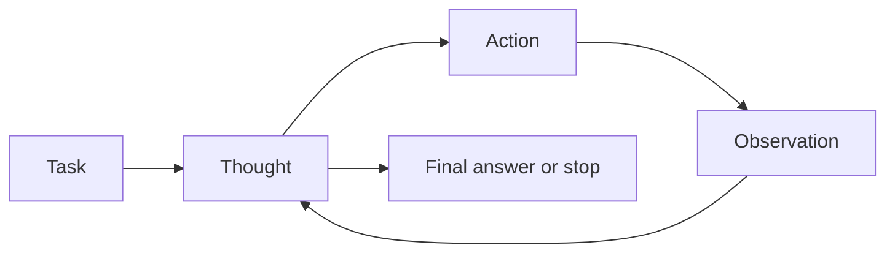

import SupportCTA from "/snippets/support-cta.mdx";

<SupportCTA />

## Summary

Reasoning and control patterns define how an agent alternates between thinking,
acting, and stopping. They are less about model intelligence than about how the
system structures decisions over time.

## Why It Matters

Two agents with access to the same model and tools can behave very differently
depending on control pattern. One may search effectively, another may loop,
hallucinate, or call the wrong tool at the wrong time.

Pattern choice therefore shapes:

- action quality
- explainability
- cost and latency
- recovery behavior

## Mental Model

The imported reference material uses ReAct as the clearest baseline. Its core
idea is simple:

- think about the current state
- take one action
- observe the result
- repeat

That design is powerful because reasoning and action correct one another. It is
especially useful when the system needs outside information or tool execution
before it can continue.

The broader lesson is that control patterns define where reasoning happens:

- before action
- between actions
- after failure
- or at explicit stopping points

## Architecture Diagram

## Tool Landscape

Common reasoning and control patterns include:

- stepwise think-act-observe loops for open-ended tool use
- guarded tool selection where actions are constrained by narrow interfaces
- explicit stop or handoff rules that prevent endless loops
- traceable reasoning surfaces that expose enough intermediate state to debug
  decisions without forcing every token into the final answer

The important design choice is not whether to show chain-of-thought. It is
whether the system has enough internal control structure to keep actions
purposeful and recover when evidence changes.

## Tradeoffs

- Stepwise loops are adaptable, but they are slower than direct execution and
  can drift without strong stopping conditions.
- Highly interpretable control surfaces make debugging easier, but they can
  feel verbose and expensive.
- Narrow tool surfaces reduce mistakes, but they can also limit flexibility.
- Rich intermediate reasoning can improve decisions, but only if the system can
  keep that reasoning aligned with the actual task.

Useful defaults:

- prefer stepwise control when tool feedback changes the next best action
- add explicit stop conditions before adding more tool breadth
- keep the control loop inspectable enough to debug, even if the final product
  hides most of that internal machinery

## Citations

- Source input: [Chapter 4 Building Classic Agent Paradigms](https://github.com/datawhalechina/Hello-Agents/blob/main/docs/chapter4/Chapter4-Building-Classic-Agent-Paradigms.md)
- Source input: [Hello-Agents upstream repository](https://github.com/datawhalechina/Hello-Agents)

## Reading Extensions

- [Planning And Reflection](/patterns/planning-and-reflection)
- [Protocols And Interoperability](/systems/protocols-and-interoperability)
- [Patterns Overview](/patterns)

## Update Log

- 2026-04-21: Initial repo-native draft based on imported reference material and lab rewrite rules.
