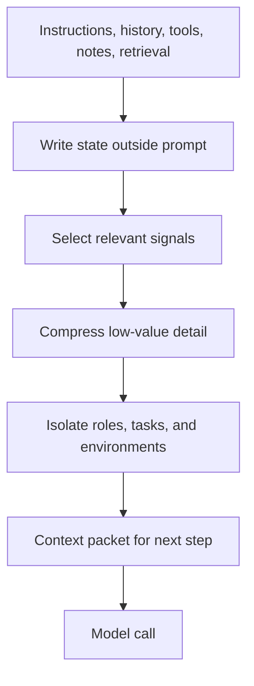

## Summary

Context engineering is the operational discipline of deciding what the model
sees before each step. It is broader than prompt writing because it includes
instructions, tools, retrieved evidence, notes, active state, and the rules
that keep all of that inside a limited attention budget.

## Why It Matters

Agents fail less often when their context is intentionally assembled. The
failure mode is usually not "the model is weak" but "the model saw the wrong
mix of instructions, history, evidence, and noise".

This matters most for long-horizon work:

- research that spans many search iterations
- development work across multiple files and decisions
- operations tasks with changing state
- multi-agent workflows where each actor should see only what it needs

## Mental Model

Context engineering can be reduced to four actions:

- `write`: persist state outside the immediate prompt
- `select`: choose the most relevant pieces for the next step
- `compress`: summarize or trim what no longer deserves full fidelity
- `isolate`: keep unrelated work, tools, or agents from polluting one another

The practical question is never "how big is the model window?" It is "what is
the minimum high-signal context that still lets this step succeed?"

That leads to four common risks:

- `context poisoning`: a wrong assumption or hallucination gets preserved and
  keeps steering later steps.
- `context distraction`: the prompt is crowded with history, so the model keeps
  attending to the past instead of solving the current problem.
- `context confusion`: extra but irrelevant material dilutes the task.
- `context clash`: two parts of the context disagree, and the model locks onto
  the wrong one.

## Architecture Diagram

Context engineering is therefore a packaging system, not a single prompt.

## Tool Landscape

Effective context systems usually combine several surfaces:

- system instructions that stay stable over time
- structured notes or scratchpads for progress and blockers
- retrieval pipelines for external evidence
- lightweight file or environment exploration for just-in-time inspection
- compaction rules that convert long history into durable summaries
- subagent boundaries that prevent one exploration path from flooding every
  other path

The design target is not maximal completeness. It is clean state transfer.
When a system supports long tasks well, it usually means it can hand off only
the necessary state from one step to the next.

## Tradeoffs

- Richer context can improve recall, but it also increases distraction and
  cost.
- Aggressive compression saves tokens, but it risks losing key constraints or
  subtle evidence.
- Just-in-time retrieval keeps prompts lighter, but it adds tool latency and
  requires stronger execution heuristics.
- Subagents improve focus, but they introduce coordination overhead and make
  summarization quality more important.

Useful operating defaults:

- Keep durable constraints outside volatile chat history.
- Summarize old history before the model starts failing under load.
- Treat notes as first-class state, not an afterthought.
- Use isolation whenever different tasks, roles, or environments would
  otherwise compete for the same window.

## Citations

- Source input: [Chapter 9 Context Engineering](https://github.com/Prompthon-IO/agentic-lab/blob/main/references/hello-agents-main/docs/chapter9/Chapter9-Context-Engineering.md)
- Source input: [Extra02 Context Engineering Supplement](https://github.com/Prompthon-IO/agentic-lab/blob/main/references/hello-agents-main/Extra-Chapter/Extra02-%E4%B8%8A%E4%B8%8B%E6%96%87%E5%B7%A5%E7%A8%8B%E8%A1%A5%E5%85%85%E7%9F%A5%E8%AF%86.md)

## Reading Extensions

- [Agent Memory And Retrieval](../patterns/agent-memory-and-retrieval)
- [Protocols And Interoperability](./protocols-and-interoperability)
- [Systems Overview](./README)

## Update Log

- 2026-04-21: Initial repo-native draft based on imported reference material and lab rewrite rules.
