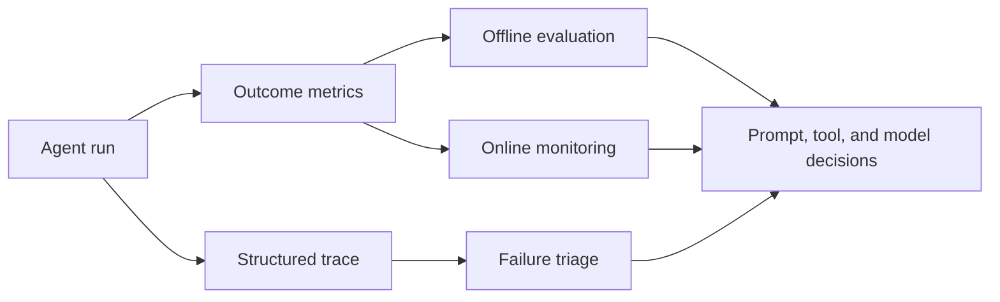

## Summary

Evaluation tells you whether the agent is good enough for a task. Observability
tells you why it passed or failed. Production systems need both, because scores
without traces are hard to improve and traces without metrics are hard to
prioritize.

## Why It Matters

Agent systems are probabilistic and multi-step. That makes them harder to judge
than deterministic software.

- A correct answer may depend on search, tools, or file state.
- The same task can fail for very different reasons.
- A prompt or model change can improve one capability while silently harming
  another.

Teams therefore need two loops:

- an `evaluation loop` for measuring capability
- a `diagnostic loop` for explaining behavior

## Mental Model

Think in three layers.

- `offline evaluation`: benchmark-style checks run on known tasks to compare
  prompts, models, tools, and policies.
- `online evaluation`: production signals such as success rate, latency,
  escalation rate, retries, or human overrides.
- `observability`: traces, tool logs, state transitions, and artifacts that
  show what the system actually did.

Different task types need different metrics.

- Tool use often needs structured correctness checks such as function and
  parameter matching.
- General assistant tasks often need answer-level correctness plus task-level
  completion.
- Data generation or synthesis tasks may need comparative review, judge models,
  or human verification.

## Architecture Diagram

## Tool Landscape

The imported reference material highlights three useful evaluation shapes:

- benchmark-style tool-use evaluation, where structured matching checks whether
  the agent selected the right function and arguments
- general-assistant evaluation, where tasks require multi-step reasoning and
  broader success judgments
- generation-quality evaluation, where relative comparison or human review is
  often more useful than one exact metric

Observability should remain structured from the start.

- Keep full tool inputs and outputs.
- Preserve failure records rather than collapsing them into generic errors.
- Track step order, retries, and state changes.
- Keep traces readable by both humans and machines.

That is what turns a black-box failure into an actionable bug.

## Tradeoffs

- Offline benchmarks are useful, but they can overfit the system to lab tasks
  that are cleaner than production reality.
- Online metrics reflect real usage, but they lag and are noisy without good
  segmentation.
- Judge-model evaluation scales well, but it still needs human calibration.
- Rich traces improve diagnosis, but they create storage, privacy, and review
  overhead.

Useful operating defaults:

- evaluate the capability you are actually changing
- keep traces for both failed and successful runs
- review failure modes before rewriting prompts
- do not ship "tool failed" as the only explanation developers can see

## Citations

- Source input: [Chapter 12 Agent Performance Evaluation](https://github.com/Prompthon-IO/agentic-lab/blob/main/references/hello-agents-main/docs/chapter12/Chapter12-Agent-Performance-Evaluation.md)
- Source input: [Extra09 Agent build pitfalls and observability lessons](https://github.com/Prompthon-IO/agentic-lab/blob/main/references/hello-agents-main/Extra-Chapter/Extra09-Agent%E5%BA%94%E7%94%A8%E5%BC%80%E5%8F%91%E5%AE%9E%E8%B7%B5%E8%B8%A9%E5%9D%91%E4%B8%8E%E7%BB%8F%E9%AA%8C%E5%88%86%E4%BA%AB.md)

## Reading Extensions

- [Protocols And Interoperability](./protocols-and-interoperability)
- [Deep Research Agents](../case-studies/deep-research-agents)
- [Systems Overview](./README)

## Update Log

- 2026-04-21: Initial repo-native draft based on imported reference material and lab rewrite rules.
