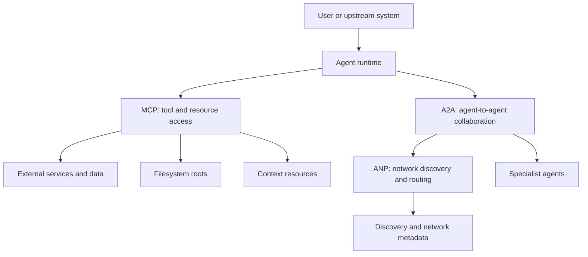

# Protocols And Interoperability

## Summary

Agent protocols are the interface contracts that let systems discover,
describe, and call capabilities beyond their own prompt loop. They matter when
tool access, agent collaboration, or network discovery need to scale beyond
one-off adapters.

## Why It Matters

A single agent can get surprisingly far with direct tool wrappers. The trouble
starts when the system needs to grow:

- multiple external services with inconsistent interfaces
- multiple agents with different roles
- multiple runtimes or organizations that need a shared contract

At that point, interoperability stops being a convenience and becomes a system
design problem.

## Mental Model

The three protocol families highlighted in the imported source material solve
different jobs:

- `MCP` standardizes how models and external tools or resources describe and
  expose capabilities.
- `A2A` standardizes how one agent delegates or collaborates with another
  agent-like service.
- `ANP` focuses on discovery and routing across larger agent networks.

The mistake is to treat them as interchangeable. They are better understood as
different layers:

- access layer: how a model reaches capabilities
- collaboration layer: how specialized actors coordinate
- network layer: how those actors are found and connected

That layer split gives readers a quick test:

| If the question is... | Start with... | Because... |
| --- | --- | --- |
| How does the agent call a tool or read a resource? | MCP | The boundary is capability and context access. |
| How does one agent hand work to another agent-like service? | A2A | The boundary is delegation and collaboration. |
| How are agents discovered across a larger network? | ANP | The boundary is routing and discovery. |

For local-agent systems, MCP also adds two important context-boundary concepts:

- `roots`: filesystem boundaries that tell a server which local directories or
  files are in scope.
- `resources`: application-provided context objects such as files, database
  schemas, or project records that a client can list, read, select, or refresh.

Roots are about the operating boundary. Resources are about the context surface.
Keeping those separate prevents a common design mistake: giving an agent broad
"file access" without explaining which local area is allowed and which concrete
objects are being passed into model context.

A local project root, a selected policy file, and a remote CRM connector are
therefore different things. A strong design names each one instead of hiding
them behind a generic claim that the agent "has context."

## Architecture Diagram

## Tool Landscape

Protocol adoption usually follows the maturity of the surrounding system.

- Direct wrappers are often enough for a small private toolset.
- MCP becomes attractive when capability descriptions, transport boundaries,
  and tool reuse matter across models or teams.
- A2A becomes attractive when the system has durable specialist roles and task
  handoffs that deserve explicit lifecycle handling.
- Network-style discovery matters only when the system is large or open enough
  that preconfigured routing stops being realistic.

Transport also matters. Local `stdio` style access fits trusted local tooling.
Remote transports fit shared infrastructure, but they expand the security
surface and operational burden.

### Local and remote boundaries

The local-versus-remote distinction is not only about where the code runs. It
also changes what must be governed:

- Local `stdio` servers can fit personal tools, project scripts, and repository
  workflows because they run as local processes and can see nearby environment
  state.
- Remote MCP servers fit shared services and cloud integrations, but they need
  clearer authentication, authorization, and lifecycle handling.
- Roots should be treated as explicit permission boundaries, not convenience
  hints.
- Resources should be treated as selected context, not automatic permission to
  crawl everything behind a connector.

OpenAI's remote MCP support in the Responses API makes the remote side more
concrete for API builders. The MCP roots and resources specifications make the
local side more concrete for tools that need project or file context.

Read this as a governance split:

- `local stdio`: easiest to inspect, but tied to the user's machine and nearby
  environment state
- `remote MCP`: easier to share across systems, but requires stronger auth,
  lifecycle, and service-boundary decisions
- `roots`: the directories or files a local server should understand as
  available
- `resources`: selected context objects the application exposes for model use

The practical review question is not "does this use MCP?" It is "which
boundary does MCP make explicit here?"

Useful default:

- Use direct local tools when the system is private, small, and easy to audit.
- Use local MCP when the same local capability should be discoverable and
  reusable across agent clients.
- Use remote MCP when a shared service boundary is more important than the
  simplicity of a local script.

## Tradeoffs

- Protocols reduce one-off integration work, but they add abstraction,
  lifecycle handling, and operational complexity.
- Rich capability discovery is powerful, but only if permission boundaries are
  explicit and the caller can trust the descriptions it receives.
- Agent-to-agent delegation can improve specialization, but it can also hide
  responsibility if artifacts, ownership, and failure states are vague.
- Network discovery helps at scale, but most teams should not pay that cost
  before they actually have a discovery problem.

Two practical defaults help:

- Prefer direct integration when the capability surface is small, trusted, and
  local.
- Adopt protocols when you need portability, reuse, or clear cross-boundary
  contracts more than you need minimum moving parts.

## Citations

- Source input: [Chapter 10 Agent Communication Protocols](../references/hello-agents-main/docs/chapter10/Chapter10-Agent-Communication-Protocols.md)
- Source input: [Hello-Agents reference boundary](../references/README.md)
- Official source: [MCP transports](https://modelcontextprotocol.io/specification/2025-03-26/basic/transports)
- Official source: [MCP roots](https://modelcontextprotocol.io/specification/2025-06-18/client/roots)
- Official source: [MCP resources](https://modelcontextprotocol.io/specification/2025-06-18/server/resources)
- Official source: [OpenAI Responses API tools and remote MCP support](https://openai.com/index/new-tools-and-features-in-the-responses-api/)

## Reading Extensions

- [Context Engineering](./context-engineering.md)
- [Evaluation And Observability](./evaluation-and-observability.md)
- [Systems Overview](./README.md)

## Update Log

- 2026-04-24: Clarified protocol-layer boundaries and added a quick decision
  table for MCP, A2A, ANP, roots, resources, and remote MCP.
- 2026-04-23: Refreshed the protocol guidance with local roots, resources, and
  remote MCP boundary notes.
- 2026-04-21: Initial repo-native draft based on imported reference material and lab rewrite rules.
