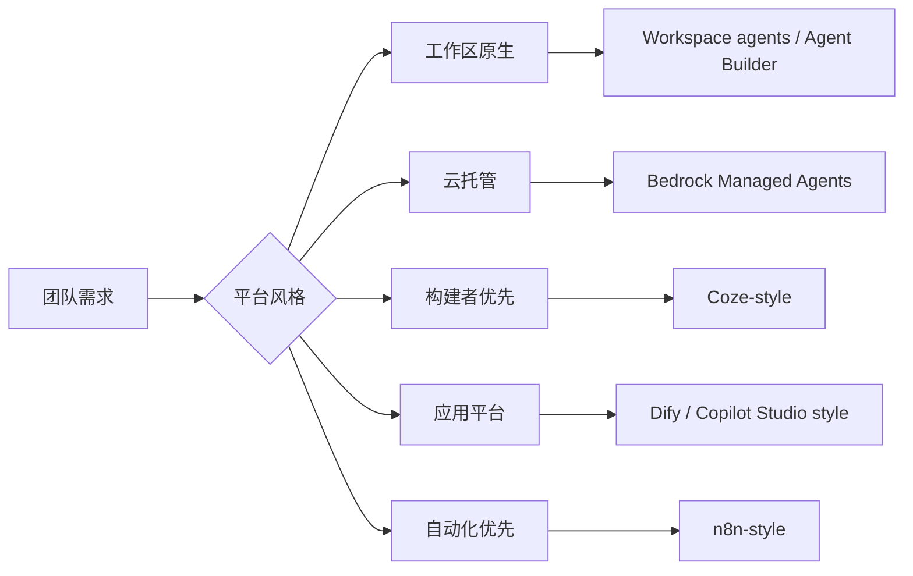

import SupportCTA from "/snippets/support-cta-zh-Hans.mdx";

<SupportCTA />

## 概要

低代码智能体平台会把重复出现的应用模式转化为可视化、配置优先、工作区原生或云托管的构建模块。到了 2026 年，比较范围不仅包括独立的构建产品，也包括存在于现有生产力套件内部的智能体构建器，以及托管云运行时。

## 为什么这很重要

并非每个有用的智能体都需要从自定义框架开始。许多团队首先需要验证产品界面、连接常见服务，或者让非工程背景的利益相关者参与到工作流构建中。

这正是构建者优先、平台优先、自动化优先、工作区原生和云托管界面变得有吸引力的地方。

## 心智模型

当前平台市场指向七个有用的锚点：

- `Coze`：面向快速组装、插件和发布的构建者优先体验
- `Dify`：面向编排、插件、知识和部署控制的应用平台
- `n8n`：自动化优先的工作流平台，智能体逻辑位于更广泛的流程链中
- `Workspace agents`：ChatGPT 和 Slack 中的共享云端智能体，用于长时间运行的团队工作流
- `Agent Builder`：Microsoft 365 中的上下文内智能体创建，用于快速声明式场景
- `Copilot Studio`：面向更大受众、自定义集成和更高级控制的更广泛 Microsoft 平台
- `Bedrock Managed Agents`：面向 OpenAI 驱动智能体的 AWS 托管运行时，适合需要云治理、服务就近性和托管运维的场景

这些是不同的选择，不是直接替代品。

- 构建者优先产品优化快速创建和操作者友好性
- 工作区原生构建器优化现有套件中的共享智能体
- 云托管构建器优化企业运行时所有权和治理
- 应用平台优化更广泛的产品与部署控制
- 自动化平台优化与现有业务流程的集成

## 架构图

## 工具版图

### 全球与企业覆盖

- Workspace agents 展示了一种新的工作区原生构建器界面，团队可以在 ChatGPT 内创建共享云端智能体，在后台运行长时间任务，并将智能体保持在现有组织控制之内。
- Agent Builder 在 Microsoft 侧展示了同样的方向：在上下文中使用 Microsoft 365 知识源构建快速声明式智能体，可在套件内共享，但有意比 Copilot Studio 更窄。
- 当受众更大、工作流更复杂，或者智能体需要比 Agent Builder 设计目标更强的自定义集成和部署管理时，Copilot Studio 就变得很重要。
- Bedrock Managed Agents 指向一种云托管的企业界面：团队可以在 AWS 基础设施上运行 OpenAI 驱动的智能体，同时把推理、记忆、技能、身份、审计日志、服务连接和云边界内运维等运行时问题交给提供商处理。
- Dify 仍然代表更广泛的开源应用平台模式，其中编排、部署控制和可扩展性需要同时成立。
- n8n 仍然代表自动化优先模式，在这种模式下，智能体只是运营流水线中的一个步骤，而不是整个产品界面。

### 中国相关覆盖

- Coze 和 Dify 仍然是面向中国相关场景的强参考点，分别代表构建者优先和平台优先的智能体产品，并具备丰富的插件扩展路径。

### 选择标准

- 当团队已经在宿主套件中工作，并希望获得带有内置治理和熟悉权限的共享智能体时，选择工作区原生构建器。
- 当团队已经标准化在某个云提供商的数据边界、治理模型和相邻服务上时，选择云托管智能体。
- 当快速迭代和跨职能参与最重要时，选择构建者优先平台。
- 当你需要在原型、编排和可部署产品界面之间建立更强桥梁时，选择应用平台。
- 当智能体必须存在于现有运营流水线中，例如邮件、CRM 或内部运维工具时，选择自动化优先平台。
- 当套件内构建器对于受众范围、工作流深度或集成来说变得过于受限时，选择像 Copilot Studio 这样更广泛的企业平台。

## 权衡

- 更快的组装通常意味着比代码更弱的细粒度控制。
- 工作区原生构建器之所以有吸引力，是因为它们减少了设置工作并与现有权限保持一致，但它们受限于宿主套件的扩展模型、发布节奏和定价。
- 云托管智能体减少了运行时所有权，但会提高对提供商特定能力、定价、区域可用性和发布时机的依赖。
- 可视化平台提升了可访问性，但复杂流程仍然可能变得难以调试。
- 丰富的插件生态可以加速能力增长，但也会带来依赖和信任问题。
- 内置存储、记忆或检索层对原型可能很方便，但对生产级持久性来说可能不够。

实用默认做法：

- 使用套件原生构建器快速验证共享内部工作流
- 当服务就近性、可审计性和托管运行时运维比框架可移植性更重要时，使用云托管智能体
- 当宿主界面成为阻碍时，迁移到更广泛的平台或自定义代码
- 尽早将原型便利性与生产需求分开考虑
- 从一开始就明确治理、部署范围和集成深度

## 引用

- 来源说明: [Chapter 5 Building Agents with Low-Code Platforms](https://github.com/datawhalechina/Hello-Agents/blob/main/docs/chapter5/Chapter5-Building-Agents-with-Low-Code-Platforms.md)
- 来源说明: [Extra03 Dify walkthrough](https://github.com/datawhalechina/Hello-Agents/blob/main/Extra-Chapter/Extra03-Dify%E6%99%BA%E8%83%BD%E4%BD%93%E5%88%9B%E5%BB%BA%E4%BF%9D%E5%A7%86%E7%BA%A7%E6%93%8D%E4%BD%9C%E6%B5%81%E7%A8%8B.md)
- 来源说明: [n8n install guide](https://github.com/datawhalechina/Hello-Agents/blob/main/Additional-Chapter/N8N_INSTALL_GUIDE.md)
- 当前官方平台阅读材料列在 `external_readings` 中。

## 延伸阅读

- [智能体框架](/zh-Hans/ecosystem/agent-frameworks)
- [智能体与工作流](/zh-Hans/foundations/agents-vs-workflows)
- [生态概览](/zh-Hans/ecosystem)

## 更新日志

- 2026-05-01：根据七天趋势运行结果，加入 Bedrock Managed Agents 作为云托管企业智能体平台信号。
- 2026-04-23：根据当前 workspace-agent 和 Microsoft 构建者平台信号刷新页面。
- 2026-04-21：基于导入的参考材料和实验室重写规则形成的仓库原生初稿。
