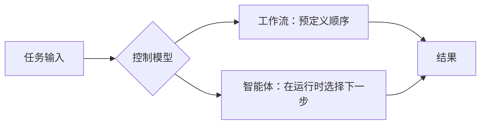

import SupportCTA from "/snippets/support-cta-zh-Hans.mdx";

<SupportCTA />

## 摘要

工作流执行预定义的顺序。智能体在变化的条件下追求一个目标。大多数真实系统都处于这两种极端之间。

## 为什么这很重要

许多产品和工程错误都源于选择了错误的控制模型。

- 如果任务是稳定的，使用智能体会增加成本和不可预测性。
- 如果任务是模糊且不断变化的，只使用僵硬的工作流会让系统变得脆弱且难以维护。

选错模式往往比选错模型更有破坏性。

## 心智模型

最清晰的区别在于下一步由谁来决定。

- 在 `workflow` 中，设计者拥有下一步。系统沿着带有显式分支的脚本化路径运行。
- 在 `agent` 中，运行时拥有下一步。系统根据当前状态、工具和目标选择动作。

这并不意味着工作流简单、智能体先进。它意味着它们解决的是不同的协调问题。

工作流在以下情况下最强：

- 路径已知
- 规则稳定
- 可审计性比灵活性更重要

智能体在以下情况下最强：

- 路径无法提前完全知道
- 系统需要搜索、探索或适应
- 任务运行期间环境可能发生变化

## 架构图

## 工具生态

最有用的产品通常是混合体，而不是任一侧的纯粹示例。

- 工作流可能会在某个模糊步骤调用智能体。
- 智能体可能在一个更大的工作流中运行，并带有严格的进入、审批和退出点。
- 研究或编码系统可能在每个阶段使用类似工作流的阶段，但在阶段内部采用智能体式决策。

这种混合设计往往是实际答案，因为它在结构真正有帮助的地方保留确定性结构，同时为真正受益于自治性的部分保留自主权。

## 取舍

- 工作流更容易测试和审计，但当边界情况不断增多时，维护成本会很高。
- 智能体适应性更强，但它们需要更强的安全措施、可观测性和回退设计。
- 混合系统在实践中通常最好，但它们需要比任一极端都更清晰的接口边界。

有用的默认选择：

- 对于确定性的业务策略，选择工作流
- 对于有限范围内的探索和判断，选择智能体
- 当合规、审批或不可逆操作很重要时，用工作流控制来包裹智能体

## 引用

- 来源说明：[Chapter 1 Introduction to Agents](https://github.com/datawhalechina/Hello-Agents/blob/main/docs/chapter1/Chapter1-Introduction-to-Agents.md)
- 来源说明：[Hello-Agents upstream repository](https://github.com/datawhalechina/Hello-Agents)

## 延伸阅读

- [什么是智能体系统](/zh-Hans/foundations/the-agent-system)
- [上下文工程](/zh-Hans/systems/context-engineering)
- [基础概览](/zh-Hans/foundations)

## 更新日志

- 2026-04-21：基于导入的参考材料和实验室重写规则形成的仓库原生初稿。
