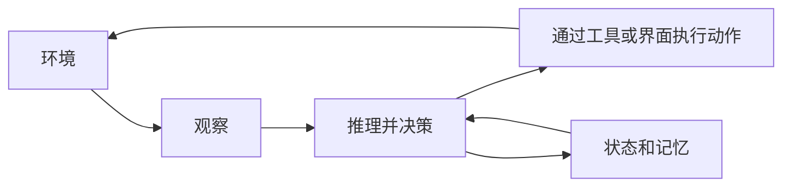

import SupportCTA from "/snippets/support-cta-zh-Hans.mdx";

<SupportCTA />

## 概要

智能体系统是一种以目标为导向的软件系统，能够感知不断变化的环境，决定下一步做什么，并通过工具或界面执行动作，同时在各步骤之间保留状态。

## 为什么这很重要

“智能体”这个词很容易被过度使用。如今许多系统只要带有聊天框或 LLM，就会被贴上这个标签。除非我们描述清楚当软件变得具备智能体特征时，实际发生了什么变化，否则这个分类就会变得不那么有用。

真正重要的转变不是系统能生成文本，而是它能管理一个动作循环：

- 感知当前状态
- 选择或修正计划
- 对外部世界采取行动
- 观察结果
- 持续进行，直到达到停止条件

## 心智模型

一个稳定的定义有四个部分：

- `environment`：系统所处并运行于其中的世界部分
- `perception`：系统如何了解该环境
- `action`：系统如何改变或查询环境
- `autonomy`：系统在感知和行动之间执行多少决策

现代智能体系统与早期自动化的区别在于，大语言模型让系统更容易处理模糊指令、选择工具、改写计划，并在环境变化时进行适应。

但这并不意味着每个 LLM 应用都是智能体系统。只有当软件具备以下特征时，这一类别才最有意义：

- 明确的任务或目标
- 一个循环，而不是单次响应
- 访问工具、API、文件或其他外部表面
- 跨步骤重要的记忆或状态

## 架构图

## 工具版图

在实践中，智能体系统可以呈现为多种形态：

- 嵌入在开发者工具或工作工具中的助手
- 追求委派目标的自主工作者
- 多智能体系统中的专门智能体
- 研究、编码或运维系统，它们会围绕证据和工具反复迭代

无论哪种形态，核心设计问题都不是“它说话像不像智能体？”而是“它是否在管理一个真实的感知-决策-行动循环？”

## 权衡取舍

- 更高的自主性可以减少人工工作量，但也会增加监控和故障处理的需求。
- 更丰富的环境会让智能体更有用，但也会让它们更不可预测。
- 更强的工具访问能力扩展了功能，但也带来了安全和策略方面的担忧。
- 更多状态能提升连续性，但也会让错误假设停留更久。

因此，良好的系统设计应从明确边界开始：

- 智能体能感知什么
- 它能做什么
- 它需要独立决定什么
- 何时必须由人类介入

## 引用

- 来源输入：[第 1 章 智能体导论](https://github.com/datawhalechina/Hello-Agents/blob/main/docs/chapter1/Chapter1-Introduction-to-Agents.md)
- 来源输入：[Hello-Agents 上游仓库](https://github.com/datawhalechina/Hello-Agents)

## 延伸阅读

- [智能体与工作流](/zh-Hans/foundations/agents-vs-workflows)
- [智能体记忆与检索](/zh-Hans/patterns/agent-memory-and-retrieval)
- [基础概览](/zh-Hans/foundations)

## 更新日志

- 2026-04-21：基于导入的参考材料和实验室重写规则，完成最初的仓库原生草稿。
