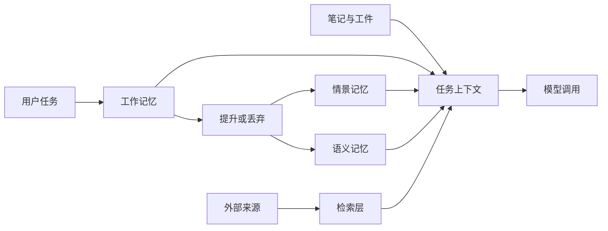

import SupportCTA from "/snippets/support-cta-zh-Hans.mdx";

<SupportCTA />

## 摘要

智能体记忆和检索是围绕模型调用的持久化层。它们决定哪些内容会超出当前轮次继续保留，哪些内容之后可以被取回，以及哪些内容应当留在提示词之外，直到真正需要时再引入。

## 为什么这很重要

没有记忆，智能体每次行动都会从零开始。没有检索，它们就只能依赖当前提示窗口里刚好装得下的内容。这会让长时间运行的工作变得脆弱，让个性化变得浅薄，也会削弱事实依据的稳固性。

一个好的设计会把三项工作分开：

- 保持当前任务的一致性。
- 保留值得日后复用的持久信号。
- 只有在能提升答案或行动时才获取外部知识。

## 心智模型

把记忆和检索看作不同但相关的系统。

- `working memory` 保存当前任务或会话的活动状态。
- `episodic memory` 存储有边界的事件、结果和经历。
- `semantic memory` 存储经过提炼的事实、规则和关系，这些内容在不同任务之间仍然有用。
- `retrieval` 访问不属于智能体自身的外部知识源。

实际上的区别不仅仅是短期与长期之分，也关乎所有权。

- 会话记忆属于正在运行的任务。
- 持久记忆属于智能体的运行历史。
- 检索索引属于外部文档、数据库或数据产品。
- 笔记和工件属于显式工作产物，例如 TODO 列表、摘要、报告或决策日志。

最后这一类很重要，因为很多系统会把所有东西都硬塞进“记忆”里而失败。研究笔记、任务清单或生成的报告，通常更适合作为工件来处理，而不是作为不可见的记忆条目。

## 架构图

设计目标不是把更多信息塞进模型，而是在正确的时间呈现正确的信息。

## 工具生态

在大多数智能体系统中，常见模式都会出现：

- 工作记忆通常使用轻量级的进程内状态，并带有容量和时间限制。
- 情景记忆通常结合结构化元数据与相似度搜索，使事件能够按语义和新近性共同被检索。
- 语义记忆通常受益于更丰富的规范化，因为当重复内容被合并、关系被明确后，持久事实会更有价值。
- 检索系统通常先从分块、索引和相关性评分开始，只有当基础流水线不够用时，才再加入重排序、扩展或查询重写。
- 当人类之后可能需要检查、编辑或批准时，笔记和工件最好以可读的形式存储。

在实践中，混合检索很常见，因为没有一种单一方法能很好地处理所有情况。关键词匹配有助于精确实体和字面值。稠密检索有助于语义相似性。结构化过滤有助于时间范围、用户范围或文档类型。合适的系统通常会把它们组合起来。

## 权衡

- 会话记忆速度快、成本低，但重启后会消失，不能被当作持久记录。
- 持久记忆提升连续性，但会引入写入质量问题：错误记忆的代价很高，因为它们会反复返回。
- 检索带来新鲜度和广度，但也会引入延迟、排序错误和引用风险。
- 笔记和工件提升可追溯性，但它们需要治理，否则智能体会生成无限堆积的过时文档。

有三个设计选择会反复出现：

- `promotion`：并不是所有工作记忆项都应该变成持久内容。
- `forgetting`：低价值或过时的记忆必须衰减、过期或归档。
- `boundary`：并不是所有知识问题都是 RAG 问题。

当智能体需要持久状态、行动历史或显式任务检查点时，RAG 并不够用。检索可以回答“文档里怎么说？”，但它不能替代任务记忆、决策日志或工件管理。

## 引用

- 来源说明：[Chapter 8 Memory and Retrieval](https://github.com/datawhalechina/Hello-Agents/blob/main/docs/chapter8/Chapter8-Memory-and-Retrieval.md)
- 来源说明：[Hello-Agents upstream repository](https://github.com/datawhalechina/Hello-Agents)

## 延伸阅读

- [上下文工程](/zh-Hans/systems/context-engineering)
- [Deep Research Agents](/zh-Hans/case-studies/deep-research-agents)
- [模式总览](/zh-Hans/patterns)

## 更新日志

- 2026-04-21：基于导入的参考材料和实验室重写规则生成的初始仓库原生草稿。
