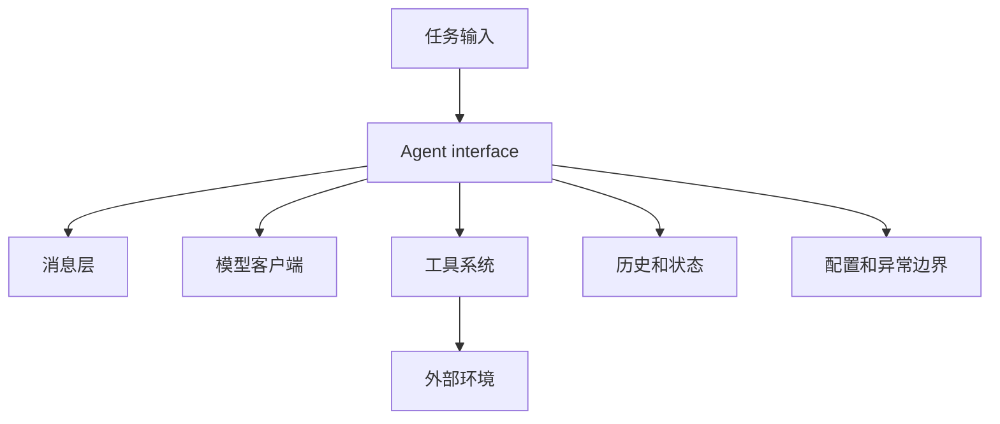

import SupportCTA from "/snippets/support-cta-zh-Hans.mdx";

<SupportCTA />

## 概述

智能体运行时由少量反复出现的组件组装而成：
消息处理、模型访问、状态管理、工具注册、执行
循环，以及故障边界。与任何单一
框架 API 相比，这些构建块更重要。

## 为什么重要

大多数智能体系统最终都会收敛到类似的运行时问题：

- 消息如何表示
- 状态存放在哪里
- 工具如何注册和调用
- 循环如何停止或重试
- 错误如何暴露

理解这些部分能让框架更容易比较，也让自定义
系统更容易设计。

## 心智模型

一个最小运行时通常需要：

- `message layer`：用于在循环中传递用户、系统、助手和工具
  内容的格式
- `model client`：调用底层 LLM 提供方的组件
- `agent interface`：拥有任务流和历史记录的执行入口点
- `tool system`：注册、描述、校验和执行的表面
- `config and exceptions`：让运行时以可预测方式运行的策略

关键的设计选择不是类层次结构，而是这些
职责是否保持清晰分离。

## 架构图

## 工具格局

健全的运行时设计通常具有以下特征：

- 消息尽早标准化，以便历史记录和跟踪保持兼容
- 模型客户端可以替换，而无需重写智能体循环
- 工具具有足够的自描述性，供运行时或模型发现它们
- 状态处理是显式的，而不是隐藏在全局副作用中
- 故障携带结构化信息，而不是通用文本块

最具可复用性的运行时还会避免把业务策略埋在核心
执行层中。运行时应当搬运工作，而不是拥有产品逻辑。

## 权衡

- 重抽象可以让运行时更灵活，但也会让它们更难
  学习和调试。
- 极简运行时易于阅读，但如果工具、状态和错误处理没有分离，
  它们可能会在复杂度增长时崩溃。
- 统一的工具接口有助于可移植性，但前提是它没有抹除
  每个工具边界的真实约束。

有用的默认做法：

- 保持运行时轻量
- 尽可能把业务决策放在核心循环之外
- 尽早标准化消息和错误
- 让工具注册足够显式，以便检查和测试

## 引用

- 来源输入：[Chapter 7 Building Your Agent Framework](https://github.com/datawhalechina/Hello-Agents/blob/main/docs/chapter7/Chapter7-Building-Your-Agent-Framework.md)
- 来源输入：[Hello-Agents upstream repository](https://github.com/datawhalechina/Hello-Agents)

## 延伸阅读

- [Reasoning And Control Patterns](/zh-Hans/patterns/reasoning-and-control-patterns)
- [Agent Frameworks](/zh-Hans/ecosystem/agent-frameworks)
- [Patterns Overview](/zh-Hans/patterns)

## 更新日志

- 2026-04-21：基于导入的参考材料和实验室重写规则，首次创建仓库原生草稿。
