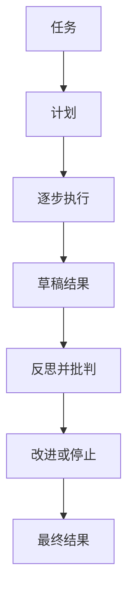

import SupportCTA from "/snippets/support-cta-zh-Hans.mdx";

<SupportCTA />

## 概要

规划和反思模式为智能体循环增加结构。规划将任务拆解为明确的执行路径。反思会评估草稿或轨迹，并决定需要改进什么。

## 为什么这很重要

纯粹的逐步控制对于更长或更有结构的任务来说，往往还不够。智能体可能需要在行动前先看到工作的整体形态，或者在生成初始答案后需要一个有意的审查步骤。

规划和反思是两种在不假设第一次输出就足够好的前提下提升质量的方法。

## 心智模型

规划模式，例如导入的源材料中强调的先规划后执行风格，会将工作分成两个阶段：

- 生成任务计划
- 按照该计划执行

反思模式会再增加一个循环：

- 生成初始答案或产物
- 批判它
- 进行改进

这些模式之所以有用，原因各不相同。

- 规划可以减少多步骤结构化任务中的偏离
- 当初稿成本低，但正确性或性能很重要时，反思可以提升质量

## 架构图

## 工具生态

当任务可以被清晰分解时，规划效果很好：

- 结构化研究
- 多步骤分析
- 带有明确阶段的代码生成

当系统能够有意义地判断并改进自身输出时，反思效果很好：

- 代码质量和性能
- 报告结构和完整性
- 需要纠错的任务轨迹

这两种模式都受益于轻量级记忆，因为计划、批评和先前草稿需要在不压垮主上下文的情况下可用。

## 权衡

- 规划可以提升连贯性，但如果无法重新规划，它也可能把系统锁死在一个较弱的计划上。
- 反思可以提升质量，但会增加延迟和模型成本。
- 详细计划有助于结构化工作，但对于简单任务来说可能变成额外开销。
- 强有力的批判提示词可以提升输出，但也会为提示词设计增加另一个可能失败的环节。

有用的默认做法：

- 当任务存在超过一条有意义的依赖链时，加入规划
- 当质量重要到足以证明再来一遍是合理时，加入反思
- 当额外审查不再改变决策时，停止迭代

## 引用

- 来源输入：[Chapter 4 Building Classic Agent Paradigms](https://github.com/datawhalechina/Hello-Agents/blob/main/docs/chapter4/Chapter4-Building-Classic-Agent-Paradigms.md)
- 来源输入：[Hello-Agents upstream repository](https://github.com/datawhalechina/Hello-Agents)

## 延伸阅读

- [Reasoning And Control Patterns](/zh-Hans/patterns/reasoning-and-control-patterns)
- [Evaluation And Observability](/zh-Hans/systems/evaluation-and-observability)
- [Patterns Overview](/zh-Hans/patterns)

## 更新日志

- 2026-04-21：基于导入的参考材料和实验室重写规则形成的仓库原生初稿。
