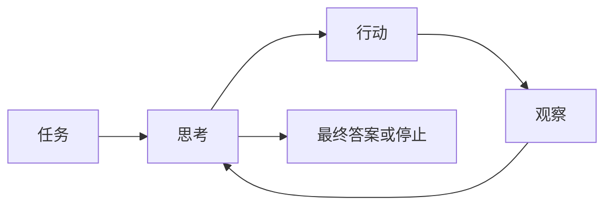

import SupportCTA from "/snippets/support-cta-zh-Hans.mdx";

<SupportCTA />

## 概要

推理与控制模式定义了一个智能体如何在思考、行动和停止之间切换。它们更关注系统如何随时间组织决策，而不是模型本身有多智能。

## 为什么这很重要

两个接入同一模型和工具的智能体，可能会因为控制模式不同而表现得非常不一样。一个可能高效搜索，另一个则可能循环、产生幻觉，或者在错误的时间调用错误的工具。

因此，模式选择会影响：

- 行动质量
- 可解释性
- 成本和延迟
- 恢复行为

## 心智模型

导入的参考材料使用 ReAct 作为最清晰的基线。它的核心思想很简单：

- 思考当前状态
- 执行一个动作
- 观察结果
- 重复

这种设计之所以强大，是因为推理和行动会彼此纠正。它在系统需要外部信息或工具执行才能继续时尤其有用。

更广泛的结论是，控制模式定义了推理发生在什么位置：

- 在行动之前
- 在行动之间
- 在失败之后
- 或在明确的停止点

## 架构图

## 工具格局

常见的推理与控制模式包括：

- 逐步思考-行动-观察循环，适用于开放式工具使用
- 带保护的工具选择，其中动作受到狭窄接口的约束
- 明确的停止或交接规则，防止无限循环
- 可追踪的推理表面，暴露足够的中间状态以调试决策，而不必把每个 token 都强制纳入最终答案

关键的设计选择不是要不要展示 chain-of-thought，而是系统是否拥有足够的内部控制结构，能够让行动保持目的性，并在证据变化时恢复。

## 权衡

- 逐步循环具有适应性，但比直接执行更慢，而且如果没有强有力的停止条件，可能会偏离。
- 高可解释性的控制表面更易于调试，但也可能显得冗长且成本更高。
- 窄工具表面可以减少错误，但也可能限制灵活性。
- 丰富的中间推理可以改善决策，但前提是系统能够让这些推理与实际任务保持一致。

有用的默认策略：

- 当工具反馈会改变下一个最佳动作时，优先使用逐步控制
- 在增加更多工具广度之前，先添加明确的停止条件
- 保持控制循环足够可检查，以便调试，即使最终产品会隐藏其中大部分内部机制

## 引用

- 来源输入：[Chapter 4 Building Classic Agent Paradigms](https://github.com/datawhalechina/Hello-Agents/blob/main/docs/chapter4/Chapter4-Building-Classic-Agent-Paradigms.md)
- 来源输入：[Hello-Agents upstream repository](https://github.com/datawhalechina/Hello-Agents)

## 延伸阅读

- [Planning And Reflection](/zh-Hans/patterns/planning-and-reflection)
- [Protocols And Interoperability](/zh-Hans/systems/protocols-and-interoperability)
- [Patterns Overview](/zh-Hans/patterns)

## 更新日志

- 2026-04-21：基于导入的参考材料和实验室重写规则的首次仓库原生草稿。
