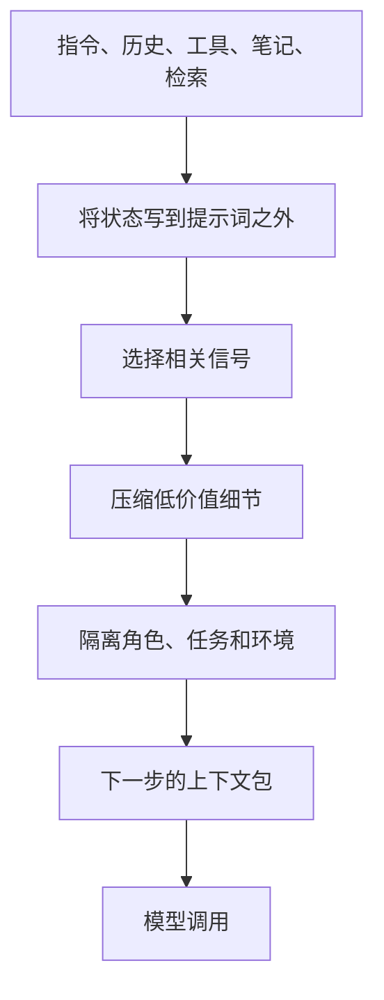

import SupportCTA from "/snippets/support-cta-zh-Hans.mdx";

<SupportCTA />

## 概要

上下文工程是一门操作性学科，负责在每个步骤之前决定模型看到什么。它比提示词编写更广，因为它包含指令、工具、检索到的证据、笔记、活动状态，以及将所有这些内容保持在有限注意力预算内的规则。

## 为什么它很重要

当智能体的上下文经过有意组装时，失败会更少。失败模式通常不是“模型很弱”，而是“模型看到的指令、历史、证据和噪声组合不对”。

这在长周期工作中最重要：

- 跨许多搜索迭代的研究
- 跨多个文件和决策的开发工作
- 状态不断变化的运维任务
- 多智能体工作流，其中每个角色都应只看到自己需要的内容

## 心智模型

上下文工程可以归结为四个动作：

- `write`: 将状态持久化到即时提示词之外
- `select`: 为下一步选择最相关的片段
- `compress`: 总结或裁剪不再值得完整保真的内容
- `isolate`: 防止无关的工作、工具或智能体相互污染

实际问题从来不是“模型窗口有多大？”而是“什么是最低限度但高信号、仍能让这一步成功的上下文？”

这会带来四种常见风险：

- `context poisoning`: 错误假设或幻觉被保留下来，并继续影响后续步骤。
- `context distraction`: 提示词被历史信息塞满，模型持续关注过去，而不是解决当前问题。
- `context confusion`: 额外但无关的材料稀释了任务。
- `context clash`: 上下文的两个部分彼此冲突，模型却锁定在错误的一方。

## 架构图

因此，上下文工程是一套打包系统，而不是单一提示词。

## 工具版图

有效的上下文系统通常会结合多个表面：

- 长期保持稳定的系统指令
- 用于进度和阻塞点的结构化笔记或草稿本
- 用于外部证据的检索流水线
- 轻量级文件或环境探索，用于即时检查
- 将长历史转换为持久摘要的压缩规则
- 防止一个探索路径淹没其他路径的子智能体边界

设计目标不是最大程度的完整性，而是干净的状态传递。  
当一个系统能很好地支持长任务时，通常意味着它能把从一个步骤到下一个步骤所需的状态精确交接过去。

## 权衡

- 更丰富的上下文可以提高召回率，但也会增加分心和成本。
- 激进压缩能节省 token，但可能丢失关键约束或微妙证据。
- 即时检索让提示词更轻量，但会增加工具延迟，并要求更强的执行启发式。
- 子智能体能提升专注度，但会引入协调开销，并让摘要质量变得更重要。

有用的默认运行方式：

- 将持久约束保留在易变的聊天历史之外。
- 在模型因负载过高而开始失效之前，总结旧历史。
- 把笔记视为一级状态，而不是事后补充。
- 当不同任务、角色或环境会争夺同一个窗口时，使用隔离。

## 引用

- 来源说明：[Chapter 9 Context Engineering](https://github.com/datawhalechina/Hello-Agents/blob/main/docs/chapter9/Chapter9-Context-Engineering.md)
- 来源说明：[Extra02 Context Engineering Supplement](https://github.com/datawhalechina/Hello-Agents/blob/main/Extra-Chapter/Extra02-%E4%B8%8A%E4%B8%8B%E6%96%87%E5%B7%A5%E7%A8%8B%E8%A1%A5%E5%85%85%E7%9F%A5%E8%AF%86.md)

## 延伸阅读

- [Agent Memory And Retrieval](/zh-Hans/patterns/agent-memory-and-retrieval)
- [Protocols And Interoperability](/zh-Hans/systems/protocols-and-interoperability)
- [Systems Overview](/zh-Hans/systems)

## 更新日志

- 2026-04-21: 基于导入的参考材料和实验室重写规则，完成仓库原生初稿。
