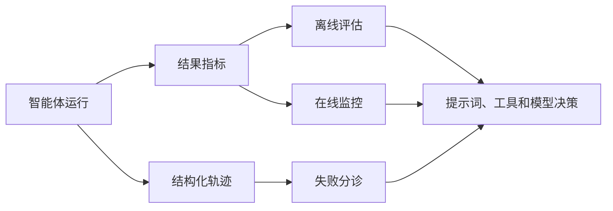

import SupportCTA from "/snippets/support-cta-zh-Hans.mdx";

<SupportCTA />

## 概述

评估告诉你智能体是否足以胜任某项任务。可观测性告诉你它为什么通过或失败。生产系统两者都需要，因为没有轨迹的分数很难改进，而没有指标的轨迹很难优先处理。

## 为什么这很重要

智能体系统是概率性的，并且是多步骤的。这使得它们比确定性软件更难判断。

- 一个正确答案可能依赖搜索、工具或文件状态。
- 同一个任务可能因为截然不同的原因而失败。
- 提示词或模型的变更可能提升某一项能力，却在不知不觉中损害另一项能力。

因此，团队需要两个循环：

- 一个 `evaluation loop` 用于衡量能力
- 一个 `diagnostic loop` 用于解释行为

## 心智模型

把它分成三层来看。

- `offline evaluation`：在已知任务上运行的类基准检查，用于比较提示词、模型、工具和策略。
- `online evaluation`：生产环境信号，例如成功率、延迟、升级率、重试次数或人工覆盖。
- `observability`：轨迹、工具日志、状态转换和产物，用于展示系统实际做了什么。

不同的任务类型需要不同的指标。

- 工具使用通常需要结构化正确性检查，例如函数和参数匹配。
- 通用助手任务通常需要答案级正确性加上任务级完成度。
- 数据生成或综合类任务可能需要对比评审、judge 模型或人工验证。

## 架构图

## 工具版图

导入的参考材料突出了三种有用的评估形态：

- 类基准的工具使用评估，其中结构化匹配用于检查智能体是否选择了正确的函数和参数
- 通用助手评估，其中任务需要多步骤推理和更广泛的成功判断
- 生成质量评估，其中相对比较或人工评审往往比单一精确指标更有用

可观测性应从一开始就保持结构化。

- 保留完整的工具输入和输出。
- 保留失败记录，而不是把它们压缩成通用错误。
- 跟踪步骤顺序、重试和状态变化。
- 让轨迹同时对人和机器都可读。

这就是把黑盒失败变成可操作 bug 的方式。

## 权衡

- 离线基准很有用，但它们可能会让系统过度贴合实验室任务，而这些任务比生产现实更干净。
- 在线指标反映真实使用情况，但如果没有良好的分段，它们会滞后且噪声很大。
- Judge 模型评估扩展性很好，但仍然需要人工校准。
- 丰富的轨迹有助于诊断，但也会带来存储、隐私和审查开销。

有用的默认运营原则：

- 评估你实际正在改变的能力
- 保留失败和成功运行的轨迹
- 在重写提示词之前先审查失败模式
- 不要把 "tool failed" 作为开发者能看到的唯一解释

## 引用

- 来源输入: [Chapter 12 Agent Performance Evaluation](https://github.com/datawhalechina/Hello-Agents/blob/main/docs/chapter12/Chapter12-Agent-Performance-Evaluation.md)
- 来源输入: [Extra09 Agent build pitfalls and observability lessons](https://github.com/datawhalechina/Hello-Agents/blob/main/Extra-Chapter/Extra09-Agent%E5%BA%94%E7%94%A8%E5%BC%80%E5%8F%91%E5%AE%9E%E8%B7%B5%E8%B8%A9%E5%9D%91%E4%B8%8E%E7%BB%8F%E9%AA%8C%E5%88%86%E4%BA%AB.md)

## 延伸阅读

- [协议与互操作性](/zh-Hans/systems/protocols-and-interoperability)
- [Deep Research Agents](/zh-Hans/case-studies/deep-research-agents)
- [系统概览](/zh-Hans/systems)

## 更新日志

- 2026-04-21：基于导入的参考材料和实验室重写规则的初始 repo 原生草稿。
