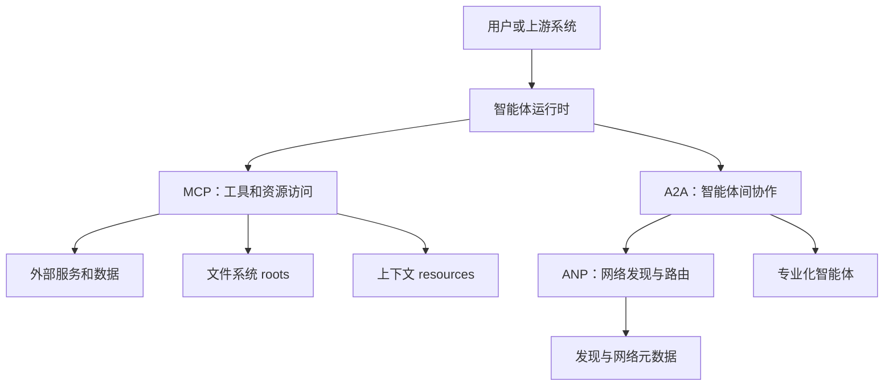

import SupportCTA from "/snippets/support-cta-zh-Hans.mdx";

<SupportCTA />

## 摘要

智能体协议是接口契约，使系统能够发现、描述并调用超出自身 prompt 循环的能力。当工具访问、智能体协作或网络发现需要扩展到一次性适配器之外时，它们就变得很重要。

## 重要性

单个智能体借助直接的工具封装就能取得相当不错的效果。问题开始于系统需要扩展时：

- 多个外部服务，接口不一致
- 多个具有不同角色的智能体
- 多个运行时或组织需要共享契约

到了这个阶段，互操作性不再只是便利性问题，而成为一个系统设计问题。

## 心智模型

导入源材料中强调的三类协议族解决的是不同工作：

- `MCP` 标准化模型与外部工具或资源如何描述并暴露能力。
- `A2A` 标准化一个智能体如何将工作委派给另一个类智能体服务，或与之协作。
- `ANP` 侧重于更大规模智能体网络中的发现与路由。

错误在于把它们当作可互换的东西。更好的理解方式是把它们看作不同层：

- 访问层：模型如何触达能力
- 协作层：专门化参与者如何协调
- 网络层：这些参与者如何被发现并连接

这种分层能让读者快速判断：

| 如果问题是... | 从...开始 | 因为... |
| --- | --- | --- |
| 智能体如何调用工具或读取资源？ | MCP | 边界在于能力与上下文访问。 |
| 一个智能体如何把工作交给另一个类智能体服务？ | A2A | 边界在于委派与协作。 |
| 智能体如何在更大网络中被发现？ | ANP | 边界在于路由与发现。 |

对于本地智能体系统，MCP 还引入了两个重要的上下文边界概念：

- `roots`：文件系统边界，告诉服务器哪些本地目录或文件在作用域内。
- `resources`：应用提供的上下文对象，例如文件、数据库 schema 或项目记录，客户端可以列出、读取、选择或刷新这些对象。

Roots 关乎运行边界。Resources 关乎上下文表面。把二者分开可以避免一个常见的设计错误：让智能体拥有广泛的“文件访问”，却没有说明允许访问哪些本地区域，以及哪些具体对象被传入模型上下文。

因此，本地项目根目录、选定的策略文件和远程 CRM 连接器并不是一回事。一个好的设计会分别命名它们，而不是用“智能体有上下文”这种泛化说法把它们掩盖起来。

## 架构图

## 工具生态

协议采用通常会随着周边系统的成熟度而演进。

- 对于小型私有工具集，直接封装通常就足够了。
- 当能力描述、传输边界和工具复用需要跨模型或跨团队时，MCP 就变得更有吸引力。
- 当系统拥有稳定的专业角色，以及值得显式生命周期处理的任务交接时，A2A 就变得更有吸引力。
- 只有当系统足够大或足够开放，以至于预配置路由不再现实，网络式发现才变得重要。

传输方式也很重要。本地 `stdio` 风格访问适合受信任的本地工具。远程传输适合共享基础设施，但会扩大安全面和运维负担。

### 本地与远程边界

本地与远程的区别不仅在于代码运行在哪里，也会改变需要治理的内容：

- 本地 `stdio` 服务器适合个人工具、项目脚本和仓库工作流，因为它们作为本地进程运行，并且可以看到附近的环境状态。
- 远程 MCP 服务器适合共享服务和云集成，但它们需要更清晰的身份验证、授权和生命周期处理。
- Roots 应被视为显式的权限边界，而不是便利性提示。
- Resources 应被视为被选中的上下文，而不是自动允许抓取连接器后面一切内容的权限。

OpenAI 在 Responses API 中对远程 MCP 的支持，使远程一侧对于 API 构建者而言更加具体。MCP roots 和 resources 规范则让本地一侧对于需要项目或文件上下文的工具更加具体。

可以把它理解为一种治理分工：

- `local stdio`：最容易检查，但与用户机器及其附近环境状态绑定
- `remote MCP`：更容易在系统间共享，但需要更强的 auth、生命周期和服务边界决策
- `roots`：本地服务器应理解为可用的目录或文件
- `resources`：应用暴露给模型使用的被选中上下文对象

实际的审查问题不是“这是不是用了 MCP？”，而是“这里由 MCP 明确了哪个边界？”

有用的默认做法：

- 当系统是私有的、小规模的、且易于审计时，使用直接的本地工具。
- 当同一项本地能力需要被不同智能体客户端发现并复用时，使用本地 MCP。
- 当共享服务边界比本地脚本的简单性更重要时，使用远程 MCP。

## 取舍

- 协议减少了一次性集成工作，但会增加抽象、生命周期处理和运维复杂度。
- 丰富的能力发现很强大，但前提是权限边界必须明确，而且调用方能够信任它收到的描述。
- 智能体间委派可以提升专业化程度，但如果产物、所有权和失败状态不清晰，也会隐藏责任。
- 网络发现有助于规模化，但大多数团队在真正遇到发现问题之前，不应该为此付出成本。

两个实用默认项会有帮助：

- 当能力面小、受信任且本地化时，优先直接集成。
- 当你更需要可移植性、复用性或清晰的跨边界契约，而不是尽量少的移动部件时，采用协议。

## 引用

- 来源输入：[Chapter 10 Agent Communication Protocols](https://github.com/datawhalechina/Hello-Agents/blob/main/docs/chapter10/Chapter10-Agent-Communication-Protocols.md)
- 来源输入：[Hello-Agents upstream repository](https://github.com/datawhalechina/Hello-Agents)
- 官方来源：[MCP transports](https://modelcontextprotocol.io/specification/2025-03-26/basic/transports)
- 官方来源：[MCP roots](https://modelcontextprotocol.io/specification/2025-06-18/client/roots)
- 官方来源：[MCP resources](https://modelcontextprotocol.io/specification/2025-06-18/server/resources)
- 官方来源：[OpenAI Responses API tools and remote MCP support](https://openai.com/index/new-tools-and-features-in-the-responses-api/)

## 延伸阅读

- [上下文工程](/zh-Hans/systems/context-engineering)
- [评估与可观测性](/zh-Hans/systems/evaluation-and-observability)
- [系统概览](/zh-Hans/systems)

## 更新日志

- 2026-04-24：澄清了协议层边界，并为 MCP、A2A、ANP、roots、resources 和 remote MCP 增加了快速决策表。
- 2026-04-23：结合本地 roots、resources 和 remote MCP 边界说明，更新了协议指南。
- 2026-04-21：基于导入的参考材料和实验室重写规则形成的仓库原生初稿。
